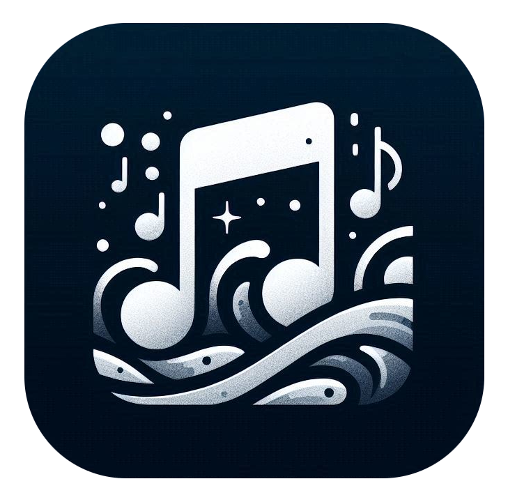

# Music-DL v2

Music-DL v2 es una aplicación de escritorio que permite descargar música desde YouTube Music con formato de audio FLAC (sin pérdidas). La aplicación está desarrollada con Python y PyQt6.



## Características

- Descarga de álbumes desde YouTube Music
- Selección de formato de audio (actualmente solo diseñado para formato FLAC)
- Interfaz gráfica intuitiva y fácil de usar
- Gestión de géneros musicales
- Multihilos para descarga simultánea
- Almacenamiento local de configuración y bases de datos

## Requisitos

- Python 3.11 o superior
- FFmpeg (incluido en /app/resources/bin)
- Conexión a Internet
- Sistema Operativo Windows 10/11

## Instalación

1. Clona el repositorio
```bash
git clone https://github.com/tu-usuario/Music-DL-v2.git
```

2. Instala las dependencias
```bash
pip install -r requirements.txt
```

3. Ejecuta la aplicación
```bash
python main.py
```

## Tecnologías

- Python 3.11
- PyQt6 (GUI)
- yt-dlp (Descarga de música)
- FFmpeg (Conversión de audio)
- SQLite3 (Base de datos)

## Dependencias Principales

- yt-dlp==2025.2.19
- PyQt6==6.8.1 
- requests==2.32.3

## Estructura del Proyecto

```
Music-DL v2/
│
├── app/
│   ├── core/
│   │   ├── __init__.py
│   │   └── config.py
│   └── resources/
│       ├── bin/
│       │   └── ffmpeg.exe
│       └── icons/
│           └── app.png
│
├── main.py
├── requirements.txt
└── README.md
```

## Uso

1. Pega la URL del álbum de YouTube Music
2. Selecciona el formato de audio (FLAC recomendado)
3. Selecciona o agrega un género musical
4. Especifica la carpeta de destino o usa la predeterminada
5. Haz clic en "Agregar" para iniciar la descarga

## Cambios desde v1

- Interfaz gráfica mejorada y más intuitiva
- Sistema de multihilos para descargas simultáneas
- Base de datos SQLite para gestión de géneros y formatos
- Configuración persistente mediante JSON
- Mejor organización del código y estructura del proyecto
- Soporte para múltiples formatos de audio

## Licencia

Este proyecto está bajo la Licencia MIT.
